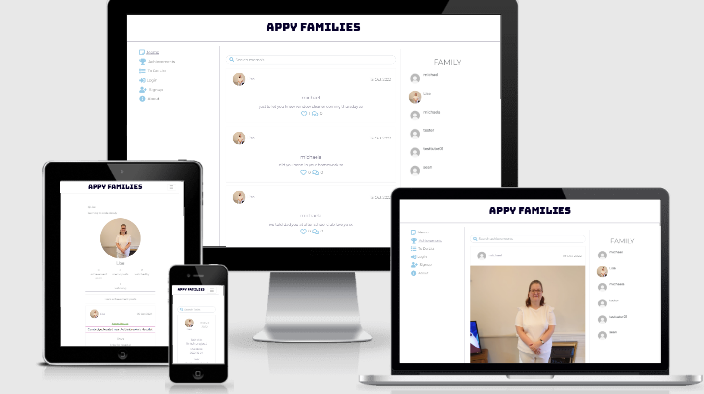
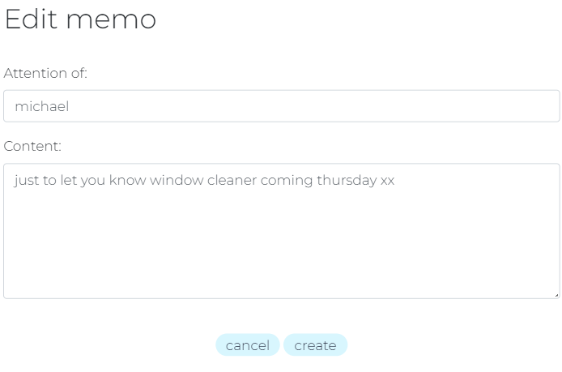
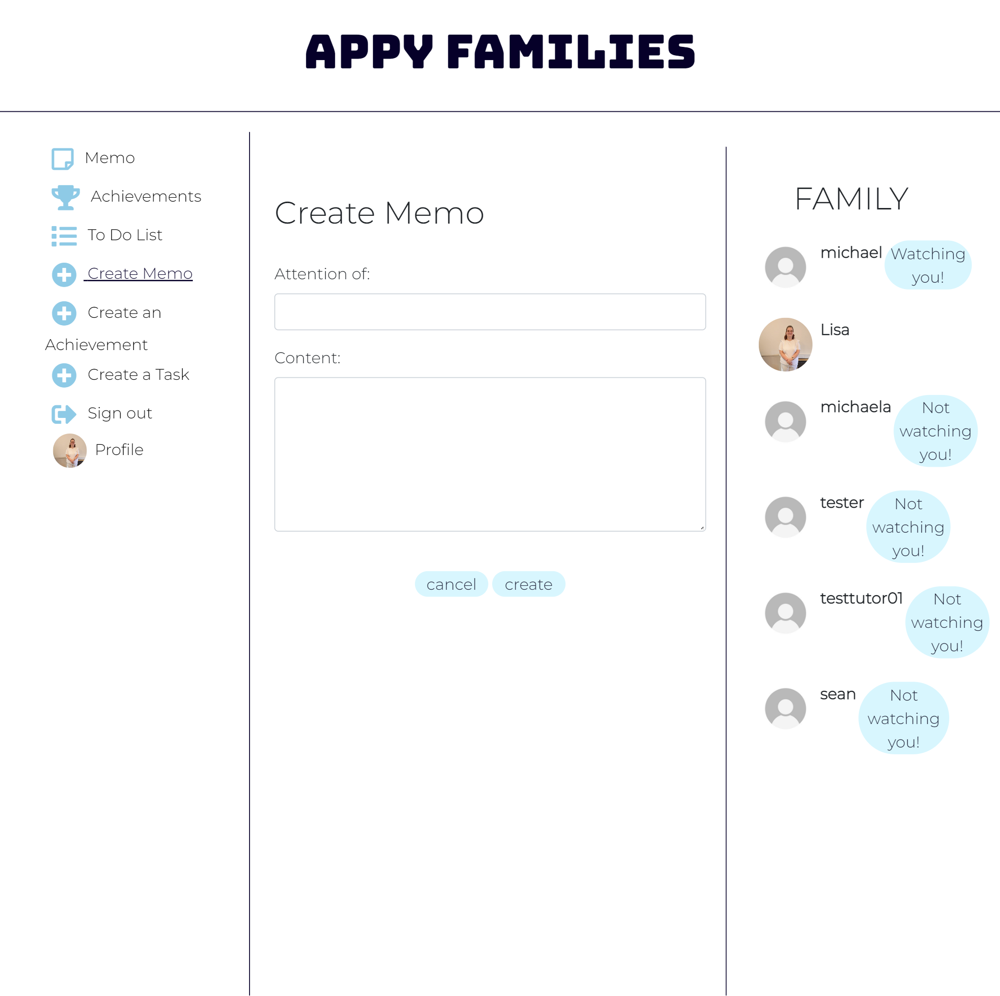
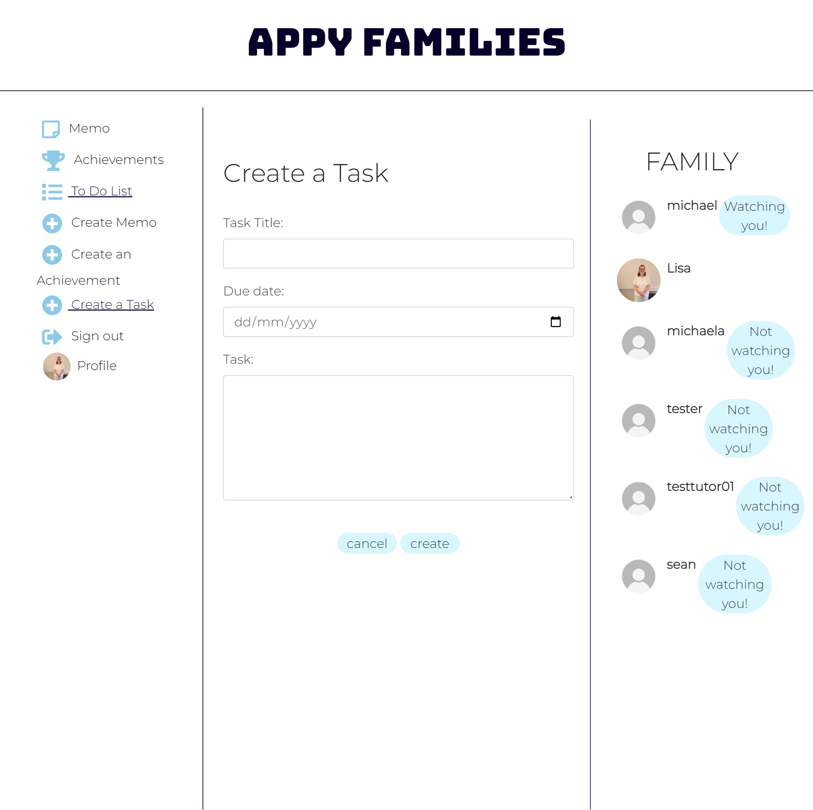
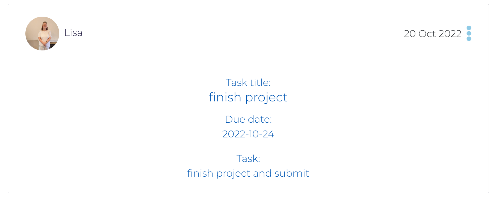
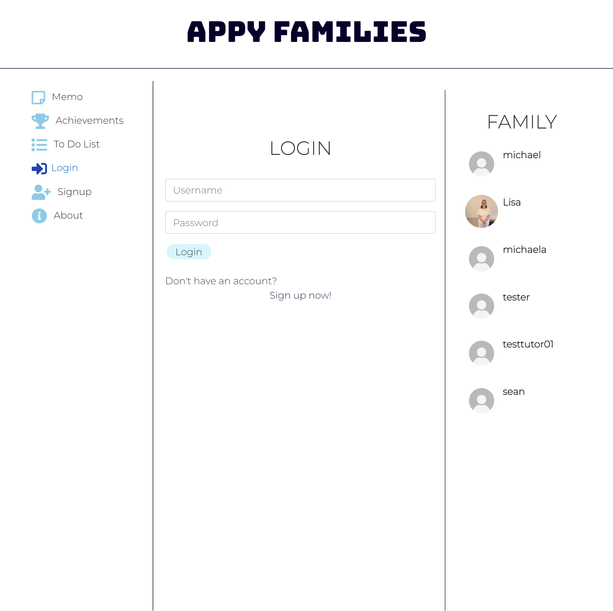

# Appy Families (front end)

## Links

- Deployed API Heroku [link](https://appy-families-drf-api.herokuapp.com/)
- Deployed Frontend Heroku [link](https://appy-families.herokuapp.com/)
- API backend [repository](https://github.com/Mrst12/pp5-backend-drf-appy-families)
- [Development board](https://github.com/users/Mrst12/projects/7)
- [User Story board](https://github.com/users/Mrst12/projects/8)



# Table Of Contents

1. [UX](#ux)
    1. [Site Purpose](#site-purpose)
    2. [Site Goal](#site-goal)
    3. [User Stories](#user-stories)
2. [Design](#design)
    1. [Wireframes](#wireframes)
    2. [Colour Scheme](#colour-scheme)
    3. [Typography](#typography)
3. [Front End Developer Role](#front-end-developer-role)
4. [Features](#features)
    1. [Navigation bar](#navigation-bar)
    2. [Memo page](#memo-page)
    3. [Achievements Page](#achievements-page)
    4. [Todo List](#todo-list)
    5. [Profile page](#profile-page)
    6. [About page](#about-page)
    7. [Registration](#registration)
    8. [Not Found page](#not-found-page)
5. [Future features](#future-features)
6. [Testing](#testing)
7. [Bugs](#bugs)
    1. [Fixed](#fixed)
    2. [Unfixed](#unfixed)
8. [Technologies used](#technologies-used)
    1. [Languages](#languages)
    2. [Frameworks, libraries, and programmes](#frameworks-libraries-and-programmes)
9. [Project Setup](#project-setup)
10. [Components](#components)
11. [Deployment](#deployment)
    1. [First deployment](#first-deployment)
    2. [Final deployment](#final-deployment)
12. [Credits](#credits)
13. [Acknowledgements](#acknowledgements)

## UX
### Site Purpose
- Ever needed to leave a note for a family member and can't find a pen?, notes dont get read by your children!, Got a list as long as your arm of things you need to do?, well this site is for you, leave memos for family members, share your achievements with your family, have a Todo list all in one place, when pen and paper dont cut it anymore head to the app that has it all, maybe your children will interact.
### Site Goal

- The goal of the site is to have an interactive family app, that everyone can use, multiple things we use on a day to day basis all in one place. Teenagers spend most of their lives looking at their mobile phones, this app allows the interactivity without the stress.

### User Stories
- I have put user stories as issues as part of agile development you can find the link [here](https://github.com/Mrst12/pp5-frontend-react-appy-families/issues)

- I have also linked my user stories to a kanban board to make them easier to work on you can find the link [here](https://github.com/users/Mrst12/projects/8/views/1)

## Design

### Wireframes
[wireframes for project](./documents/wireframes/appy-families-wireframes.pdf)
### Colour Scheme

- The following colour scheme was chosen at the start of the project, I tried to go for light neutral colours as I aim for both male and females to use the site. The site will be mainly white with the colours chosen for buttons, icons and text.


### Typography

- In the planning stages of the project, I chose *bungee spice* for the heading. As the project started I changed my mind and went for *bungee* for the heading instead.


- For the remainder of text throughout the site, I googled the best pairing for the heading, which came up with *Monserrat*.


## Front End Developer Role

Front end developers play an important role in developing an engaging user facing web applications, aiming to make sure the user stays on and returns to the site is a major objective. Front end developers work on the user interface and user experience, maintaining responsiveness and accessibility of the application. Having an understanding of how the backend part of an application works is helpful to a front end developer, as it helps to tie the two together in an approriate manner.

## Features
### Navigation bar
- There is a navigational bar down the side for larger screens, with different icons depending on wether you are logged in or not 

- Large screen logged out


- Large screen logged in


- The smaller screens have a burger icon which reveals the same navigational bar as larger screens, the heading is also a link back to the home page.


- There is an underline on the link that the user is on to show where they are on the site.

### Memo page
- The memo page is the home page it has a search function at the top, it also has infinite scroll on the posts for ease of use.


- The memo home page has all the created memo's by all users, logged in users can like other user's memo's, users can comment on memo's. These show on the memo


- comments can be edited and deleted via the dropdown menu


- There is a dropdown menu for owner users to edit or delete the memo, the edit button takes to a form to edit the memo which is prefilled



- Clicking on a memo from the home page takes you to the single memo which shows all comments underneath, the comments have an infinite scroll function for ease of use.

- Logged in users can create a new memo by clicking on the **create memo** link in the navigational bar, this will take them to the create form



### Achievements Page
- The achievements page can be reached via the navigational bar, this page lists all created achievements by all users. This page has an infinite scroll for ease of use.


- There is a dropdown menu which allows owner users to edit or delete their achievements, the edit button takes the user to a edit achievement form which is prefilled.


- Achievements can be liked by users that dont own the achievement, all logged in users can comment on the achievements, comments can be edited and deleted by owner users.


- When clicking on an achievement it will display the single achievement and its related comments, comments have an infinite scroll feature for ease of use.


### Todo List
- The todo page can be reached by the **To Do List** link on the navigational bar. The page has an infinite scroll for ease of use.

- Logged in users can create a task for the Todo list via the link **Create a Task** which will take them to a create form



- Tasks can be edited and deleted by owner users via the dropdown menu, which will take the user to an edit form which is prefilled.


- To view a single task users can click on the task and it will display only the one task.


### Profile page
- The profile page can be reached via the main navigational bar, or by clicking any user avatar, the user that owns the profile can edit their name, bio and profile picture, they can also change their username and password. the profile page shows that users achievement posts.


- The profle page has a button at the top to watch or not watch a user the statistics of how many are watching and how many a user watches are in the profile page, this can also be accessed from the side family bar.


### About page
- Before a user logs in or registers there is an about page on the navigational bar which allows the user wether to register for the site.


### Registration
- A user can register for full functionality of the site rather than just read, the posts they can like, comment, create, edit and update things as an owner, they cannot however like their own posts.
The register form once completed takes the user straight to the signin page which then redirects to the site.




### Not Found page
- If a user comes to a page that doesnt exist it will display a page saying its not found, the navigational bar is still present to take them wherever they want to go.


## Future features
- In the future I would like to implement a modal for the delete function, so a box pops up and asks a user if they are sure they want to delete something.
- In the future I would like to implement a share feature to share the posts.
- In the future I would like to add a tag feature so people can tag each other.
- In the future I would like to implement chat on the site instead of just commenting.

## Testing
- The testing for the front end part of the project can be found [here](./TESTING.md)
- The testing for the backend part of the project can be found [here](https://github.com/Mrst12/pp5-backend-drf-appy-families/blob/main/TESTING.md)

## Bugs
### Fixed

- The likes on the achievements page were not being recorded, the number was going up continuously, but a like was not being sent to the API. Fixed by changing the id from achievements to achievement_post in achievements.js for the *post* request.

- The dropdown menu was not rendering on achievements page, with the help of *Ed* from tutor support, it was fixed via changing the prop name from AchievementsPage to setAchievement. The dropdown then rendered as intended.

- Upon trying to deploy the frontend to Heroku, the deploy was failing due to node package not being in my package.json file, after contacting tutor support Scott helped fix the problem by addding an engine with node package number to the file, which then successfully deployed my application.

### Unfixed
- none known

## Technologies used
### Languages

- HTML
- CSS
- Javascript
- Python
- SQL - postgres
### Frameworks, libraries, and programmes

- Balsamiq
    - For the wireframes
- Git
    - For version control, committing and pushing to Github
- Github
    - For storing the repository, files and images pushed from Gitpod
- Gitpod
    - IDE used to code project
- Heroku
    - used to deploy the application
- Django
    - used to build the backend database, that serves as an API for the front end part of the  project
- ReactJS
    - To build components that collectively form the front end of the application.
- React-Bootstrap
    - The styling side of the front end application used as it was introduced during the walkthrough project.
- Coolors
    - used for making colour pallete
- Google fonts
    - used for selecting fonts for project.
- Amiresponsive
    - used for testing responsiveness and providing screenshots in different sizes.
- Favicon converter
    - used to convert image to a favicon.

## Project Setup

1. Create a new repository in **Github** and use the 'gitpod' button at the top to create workspace
2. Create the React app by running the terminal command:
```
npx create-react-app . --template git+https://github.com/Code-Institute-Org/cra-template-moments.git --use-npm
```
- enter y to confirm

3. Check the app is working by using terminal command:
```
npm start
```
4. the browser should be showing you the React logo
5. In **App.js** remove the logo import, remove the custom React header element, and replace with a 'H1' element containing a line of text such as 'hello world'.
6. Check this 'H1' is being shown in your browser preview.
7. Do a terminal command to add, commit and push the code to Github


## Components

- Several components were setup throughout the project and was reused throughout.
1. MoreDropdown.js
    - added a dropdown menu for memo's, achievements, todo and profile, to allow users to edit and delete their own content.
2. AxiosDefault.js
    - helped with communication with the backend API
3. Asset.js
    - was used for the loading spinner throughout the site.
4. Avatar.js
    - used for the users avatar throughout the site.
5. CurrentUserContext.js
    - confirm users logged-in status to determine what functionality is available to that user.
6. ProfileDataContext.js
    - used for watching and unwatching users
7. useRedirect.js
    - redirects a user to another page if not authorised to access the page they are trying to access.
8. utils.js
    - supplies functionality to all of the components that utilise the Infinite Scroll.

## Deployment
### First deployment

1. In **Heroku** create a new app, give it a name and choose location.

2. In the **deploy** tab, go to 'deployment method', choose 'Github'

3. Search for the repository in Github that you want to connect and click on the connect button

4. In the 'manual deploy' section click on 'deploy branch'

5. The build log will run, when complete you will see a message saying 'build succeeded'

6. An 'Open App' button will appear, click this to take you to your deployed app.

7. You can enable automatic deploys in the 'deployment section' so each time you push your code to 'Github' your deployed app will be updated.

### Final deployment

1. Ensure all finalised code is committed and pushed to Github

2. Log into Heroku in the dashboard for your front end React project select **Deploy** from the top bar

3. Select **Deploy branch** and wait for build to complete

4. If successfully built you will see a message *deployed to heroku* click the **open app** button.

5. Test your deployed version matches development version.

## Credits
- The code institute *moments* project was used as my starting point, but adapted throughout to suit my projects needs and changed moreso as my confidence grew.

- image taken from google search for a family which I then turned into a favicon.

## Acknowledgements

- Code institute for the learning material and support.
- Tutor support for having my back through some tough times.
- My mentor for helping me with project planning, support with the last few tweaks and end of project session.
- My husband and children for their patience and unending support getting me through.
- All of the slack community especially **Kera Cudmore**, **Veronica Lourens**, **Shellie Downie**, and **Leah Fisher** who all helped keep me going when it was tough.
- My late father, my inspiration to show that hard work and determination pays off, I hope I have made him proud.
