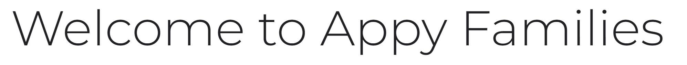

# Appy Families (front end)

# Table Of Contents

1. [UX](#ux)
    1. [Site Purpose](#site-purpose)
    2. [Site Goal](#site-goal)
    3. [User Stories](#user-stories)
2. [Design](#design)
    1. [Wireframes](#wireframes)
    2. [Colour Scheme](#colour-scheme)
    3. [Typography](#typography)
3. [Front End Developer Role](#front-end-developer-role)
4. [React and React Bootstrap](#react-and-react-bootstrap)
5. [Features](#features)
6. [Future features](#future-features)
7. [Testing](#testing)
8. [Bugs](#bugs)
    1. [Fixed](#fixed)
    2. [Unfixed](#unfixed)
9. [Technologies used](#technologies-used)
    1. [Languages](#languages)
    2. [Frameworks, libraries, and programmes](#frameworks-libraries-and-programmes)
10. [Project Setup](#project-setup)
11. [Components](#components)
12. [Deployment](#deployment)
    1. [First deployment](#first-deployment)
    2. [Final deployment](#final-deployment)
13. [Credits](#credits)
14. [Acknowledgements](#acknowledgements)

## UX
### Site Purpose
- Ever needed to leave a note for a family member and can't find a pen?, notes dont get read by your children!, Got a list as long as your arm of things you need to do?, well this site is for you, leave memos for family members, share your achievements with your family, have a Todo list all in one place, when pen and paper dont cut it anymore head to the app that has it all, maybe your children will interact.
### Site Goal

- The goal of the site is to have an interactive family app, that everyone can use, multiple things we use on a day to day basis all in one place. Teenagers spend most of their lives looking at their mobile phones, this app allows the interactivity without the stress.

### User Stories
- I have put user stories as issues as part of agile development you can find the link [here](https://github.com/Mrst12/pp5-frontend-react-appy-families/issues)

- I have also linked my user stories to a kanban board to make them easier to work on you can find the link [here](https://github.com/users/Mrst12/projects/8/views/1)

## Design

### Wireframes
[wireframes for project](./documents/wireframes/appy-families-wireframes.pdf)
### Colour Scheme

- The following colour scheme was chosen at the start of the project, I tried to go for light neutral colours as I aim for both male and females to use the site.


### Typography

- In the planning stages of the project, I chose *bungee spice* for the heading


- For the remainder of text throughout the site, I googled the best pairing for the heading, which came up with *Monserrat*.



## Front End Developer Role

Front end developers play an important role in developing an engaging user facing web applications, aiming to make sure the user stays on and returns to the site is a major objective. Front end developers work on the user interface and user experience, maintaining responsiveness and accessibility of the application. Having an understanding of how the backend part of an application works is helpful to a front end developer, as it helps to tie the two together in an approriate manner.

## React and React Bootstrap

## Features

## Future features

## Testing
- The testing for the front end part of the project can be found [here](./TESTING.md)
- The testing for the backend part of the project can be found [here](https://github.com/Mrst12/pp5-backend-drf-appy-families/blob/main/TESTING.md)

## Bugs
### Fixed
### Unfixed

## Technologies used
### Languages

- HTML
- CSS
- Javascript
- Python
- SQL - postgres
### Frameworks, libraries, and programmes

- Balsamiq
    - For the wireframes
- Git
    - For version control, committing and pushing to Github
- Github
    - For storing the repository, files and images pushed from Gitpod
- Gitpod
    - IDE used to code project
- Heroku
    - used to deploy the application
- Django
    - used to build the backend database, that serves as an API for the front end part of the  project
- ReactJS
    - To build components that collectively form the front end of the application.
- React-Bootstrap
    - The styling side of the front end application used as it was introduced during the walkthrough project.
- Coolors
    - used for making colour pallete
- Google fonts
    - used for selecting fonts for project.

## Project Setup

1. Create a new repository in **Github** and use the 'gitpod' button at the top to create workspace
2. Create the React app by running the terminal command:
```
npx create-react-app . --template git+https://github.com/Code-Institute-Org/cra-template-moments.git --use-npm
```
- enter y to confirm

3. Check the app is working by using terminal command:
```
npm start
```
4. the browser should be showing you the React logo
5. In **App.js** remove the logo import, remove the custom React header element, and replace with a 'H1' element containing a line of text such as 'hello world'.
6. Check this 'H1' is being shown in your browser preview.
7. Do a terminal command to add, commit and push the code to Github


## Components

## Deployment
### First deployment

1. In **Heroku** create a new app, give it a name and choose location.

2. In the **deploy** tab, go to 'deployment method', choose 'Github'

3. Search for the repository in Github that you want to connect and click on the connect button

4. In the 'manual deploy' section click on 'deploy branch'

5. The build log will run, when complete you will see a message saying 'build succeeded'

6. An 'Open App' button will appear, click this to take you to your deployed app.

7. You can enable automatic deploys in the 'deployment section' so each time you push your code to 'Github' your deployed app will be updated.

### Final deployment

## Credits

## Acknowledgements
