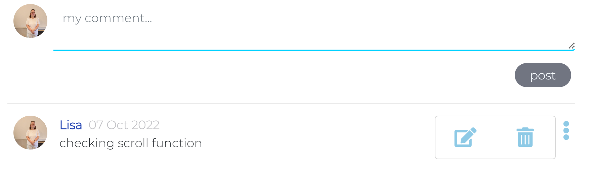

# Testing For Frontend React Appy-Families

## Contents
1. [Manual](#manual)
2. [Validation](#validation)
3. [Lighthouse](#lighthouse)
4. [User Stories](#user-stories)
    1. [Navigation and authentication](#navigation-and-authentication)
    2. [Memo page](#memo-page)
    3. [Todo page](#todo-page)
    4. [Achievements](#achievements)
    5. [Profiles](#profiles)
    6. [User experience](#user-experience)

### Manual

- Manual testing were carried out for the URL paths, search functionality and **CRUD** functionality, all were made into tables and checked off.

### URL Path tests

### Search testing
- The same table was used for development and deployment everything working as expected.

### CRUD Testing
- Table was made to check a user could **C**reate, **R**ead, **U**pdate, or **D**elete items.
- The table for deployed was testing in the back link to the front end [here](https://github.com/Mrst12/pp5-backend-drf-appy-families/blob/main/TESTING.md)
- I used a key in the table 
    - LI meaning the user was logged in, and so could Create, and read.
    - LO meaning the user was not logged in and so could only read.
    - LI/O meaning the user was logged in **and** the owner so had full CRUD functionality.

The same table was used for checks in deployed application all checks working.
### Validation
### Lighthouse

- Lighthouse scores

### User Stories
#### Navigation and authentication

- As a User I can access a navigation menu so that I can easily get between pages
    - A navigation menu for small and larger screens were added.
    - Smaller screens

    - larger screens

- As a user I can navigate through pages quickly so that I can view content without having to refresh the page
    - The navigational bar is visible on small screens via the burger menu, and at the side on larger screens, infinite scroll has been put on pages for posts and comments so the user doesn't have to refresh the page.

- As a user I can register for an account so that I can access all content
    - A signup form is available to users to register for the full functionality of the site.

- As a user I can log in to the site so that I can access all content for a logged in user

    - A login form is required to access full functionality

- As a user I can see if I am logged in or logged out so that I can log in or out as needed
    - As a logged in user the profile picture shows on the side navigation bar, and in the family bar it doesn't have a watching/notwatching button. A logged in user can access the create functions on the side navigation bar unlike a logged out user.

- As a user I can maintain my logged in status until I choose to log out so that my user experience is not compromised
    - Refresh tokens have been set within the site so a user can remain logged in.

- As a logged out user I can see sign in or register options so that I can sign in or register
    - These options are on the logged out user navbar

- As a user I can view other users avatars so that I can easily identify users of the site
    - The family is displayed on the right of the site with their avatar pictures once they have added them to their profiles. They are also on each post which links to that users profile page

#### Memo page

- As a user I can create a memo so that it can be viewed on the memo page
    - A create memo page is available to create memos which is then displayed on the memo page.

- As a memo owner I can update my memo so that I can change the message as necessary after creation
    - There is a form available to edit memo through the dropdown menu(only visible to owner), the form is prefilled with the data.

- As a memo owner I can delete my memo so that I can control the removal of the memo from the site
    - There is a dropdown menu for owner users to delete their memo.

- As a user I can search memo posts by profile name, content or who it is for so that I don't have to look through every memo
    - A search bar is on the memo page.

- As a user I can like a memo so that other users can see my interaction with their memos
    - Users can like other users memoposts if they are logged in, but cannot like their own.

- As a user I can comment on memo posts so that I can interact with the site
    - Logged in users can comment on memo posts.

- As a user I can view memos so that I can see everything that is going on within my family
    - Anyone can see all the memo's that have been created 

#### Todo page

- As a user I can create an item in the todo page so that I can see what tasks need to be done
    - A create task form is available to logged in users

- As a user I can view the Todo details so that I know all the details for the item
    - The single task detail is available by clicking on the task in the main To Do list page

- As a owner user I can update my todo list so that I have full functionality over the list
    - There is a dropdown menu available to owner users which takes them to a prefilled edit form

- As a owner user I can delete a todo item so that I am in control of my lists
    - A dropdown is available to owner users to delete their own memo

- As a user I can search the todo list page by owner profile, task title, status, or due date so that I have more control over which posts I see
    - There is a search bar at the top of the page for users to use the search functionality

#### Achievements

- As a user I can create an achievement post so that everyone can share my achievements
    - There is a create an achievement link for logged in users to share their achievements

- As a user I can view all the achievements posted so that I can see what everyone is doing in my family
    - There is a main achievements page available for everyone to see

- As a owner user I can update my achievement post so that I can make any necessary changes after creation
    - There is a dropdown menu available to owner users which takes them to a prefilled edit form

- As a owner user I can delete my achievement so that I have full control of my post
    - There is a dropdown menu available to owner users to delete their achievement post

- As a user I can comment on achievement posts so that I can interact with the other users
    - A logged in user can comment on the achievements and edit or delete their own comment

- As a user I can like a users achievement so that I can interact with other users showing I like their post
    - There is a heart icon on each achievement logged in users that don't own the achievement can like them

#### Profiles

- As a user I can create my own profile so that others can see information about me
- As a user I can update my profile so that the information about me is up to date
- As a user I can view the profile pages of users so that I can get to know more information about them
- As a user I can update my username and password so that I can keep my profile secure

#### User experience

- As a user I can view an about page so that I can see what the site is about
- As a user I can keep scrolling through posts that are loaded automatically so that I don't have to click next page to see other posts
- As a user I can easily use the site so that I want to keep returning